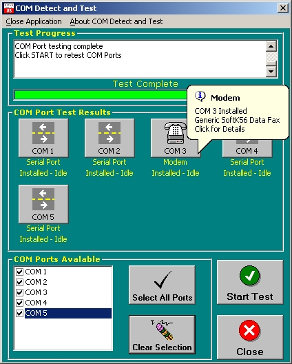



## COM Detect and Test, Ver 2

### Description

A freshening up of a previous PSC submission. I gave the original to a customer of mine, and he used it to audit industrial control PC's COM ports that he didn't know if there was still an application running that used them. So as a result, He made a few suggestions for improvments in the original COM Detect App. Resultant changes are here. App now enumerates installed COM ports, allows selection of ports for test and changed some GUI issues. A usefull tool to have in your "Bag of Tricks"
 
### More Info
 

             |
---                |---
**Submitted On**   |2005-01-31 19:01:18
**By**             |[Mark Mokoski](https://github.com/Planet-Source-Code/PSCIndex/blob/master/ByAuthor/mark-mokoski.md)
**Level**          |Intermediate
**User Rating**    |4.8 (29 globes from 6 users)
**Compatibility**  |VB 6\.0
**Category**       |[Complete Applications](https://github.com/Planet-Source-Code/PSCIndex/blob/master/ByCategory/complete-applications__1-27.md)
**World**          |[Visual Basic](https://github.com/Planet-Source-Code/PSCIndex/blob/master/ByWorld/visual-basic.md)
**Archive File**   |[COM\_Detect1846131312005\.zip](https://github.com/Planet-Source-Code/mark-mokoski-com-detect-and-test-ver-2__1-58555/archive/master.zip)

